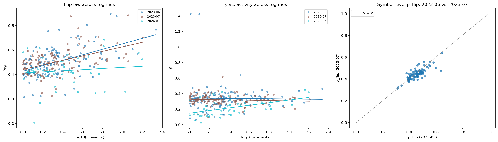

# Binance Market Microstructure

Empirical measurement of order-flow memory and price impact on Binance USDT-M perpetual futures,
from raw tick data. Three classical microstructure results — long-memory order flow, the price
response function, and order-flow-imbalance linearity — replicated on crypto and benchmarked
against the published equities literature, then carried to a **121-symbol cross-section** and a
**propagator deconvolution** that separates the bare impact kernel from flow memory, and finally
to a **41-symbol Hawkes endogeneity panel** and an **execution-cost replay** built on the kernels
those phases measured — then re-run end to end in **two further regimes**, an adjacent month and
a month three years later, to find out which of the results are laws and which are June 2023.

This is a learning-first research project. Every Phase-1 result was chosen because a published
benchmark exists to check it against; novelty is explicitly not the goal. Each result is reported
with its sample period, sample size, standard error, and the specific reasons it might be wrong.

**If you are here to understand the concepts rather than run the code, read
[LEARNING.md](LEARNING.md)** — it explains the order book, autocorrelation, impact, OFI, Hawkes
self-excitation, temporal robustness, and the statistics behind every number below, and closes
with a 21-question interview drill.

## Data

| | |
|---|---|
| Source | [data.binance.vision](https://data.binance.vision) public dumps (free, no account) |
| Market | USDT-M perpetual futures |
| Symbols | BTCUSDT, ETHUSDT (Phase 1); a 207-symbol universe, 121 analyzed (Phase 2); a 41-symbol endogeneity panel and a 6-symbol execution panel (Phase 3); the same 207-symbol universe re-run for 2023-07 and 2026-07 (Phase 4) |
| Regimes | 2023-06 (baseline), 2023-07 (adjacent month), 2026-07 (three years on) |
| `aggTrades` | **105,147,096** raw prints — BTC + ETH, 2023-06 and 2023-07 |
| `bookTicker` | **114,231,299** L1 quote updates — ETH, **14 days**, 2023-06-01 to 2023-06-14 |
| Resolution | millisecond timestamps |
| Stored as | Parquet (~1.7 GB), lazily scanned with polars |

`aggTrades` carries `is_buyer_maker`, so the aggressor side is given rather than inferred — no
Lee-Ready or tick-rule classification error enters the sign series. The 14-day `bookTicker`
window is a hard data constraint, not a choice: Binance discontinued `bookTicker` dumps after
2024-04, and 2023-06 onward is where they overlap with `aggTrades`.

Raw prints are collapsed into **aggressor events** before any analysis — all same-millisecond,
same-side prints merge into one taker decision, because one market order sweeping several book
levels prints as several rows. Skipping this step inflates the lag-1 sign autocorrelation by a
factor of about 15; see [LEARNING.md §1](LEARNING.md#1-the-order-book-and-aggressor-trades).

## Results

### Q1 — Order flow has long memory


The autocorrelation of the buy/sell aggressor sign series, plotted log-log, where a power law
appears as a straight line. Both symbols show clear long memory: correlation is still visible at
lag 1000 and decays as `lag^(−γ)` rather than exponentially. **BTCUSDT γ̂ = 0.3803** (n =
38,046,362 events) sits inside the equities/futures range of 0.3–0.7 reported by Bouchaud et al.
(2004). **ETHUSDT γ̂ = 0.2380** (n = 25,773,466) sits below it — and since a smaller exponent
means slower decay, ETH's order flow is *more* persistent than typical equities, not less.
Falling outside the equity range is a finding rather than a failure; candidate explanations
(order splitting, retail herding, thinner books, or simply this two-month regime) are discussed
in LEARNING.md, and this data cannot yet distinguish them. The visible odd/even zigzag in BTC's
curve below lag ~20 is a short-lag alternation artifact and sits outside the [10, 500] fit
window's influence on the reported slope; the quoted stderrs are OLS and understate true
uncertainty because ACF values at adjacent lags are themselves correlated.

[Full results and caveats →](results/q1_results.md)

### Q2 — The response function rises, as long-memory flow predicts


The average mid-price move in the aggressor's direction, ℓ events after a signed trade.
**R(1) = 0.0104 rises to a plateau near 0.056 around ℓ ≈ 300–500 — a ratio of 5.39×.** Impact
does not decay here, and that is the expected shape rather than an anomaly: the measured response
R mixes the bare impact kernel G with order-flow memory C via `R(ℓ) ≈ G(ℓ) + Σ G(ℓ−n)·C(n)`. Only
G decays; with long-memory flow the accumulation term dominates, so R climbs. Bouchaud's own
equity response functions show the same rise before a slow decline. The quantitative check is the
strongest evidence in this project: Q1's ETH exponent γ ≈ 0.24 and the diffusivity-consistent
kernel exponent β = (1−γ)/2 ≈ 0.38 predict R(500)/R(1) in roughly the **3.5–6.9×** band, and the
independently measured **5.39×** falls inside it — two different datasets, two different
estimators, one consistent theory. Over lags 10–200 a power law fits better than an exponential
(log-scale RSS **0.2161 vs 0.4718**). This measures R only; separating the kernel G from flow
memory C requires propagator deconvolution, which is out of scope, and the sample is a single
14-day window for one symbol.

[Full results and caveats →](results/q2_results.md)

### Q3 — Price change is linear in order-flow imbalance, but explains less than in equities


Binned mean mid-price change against summed order-flow imbalance over 10-second bars, with a
through-origin fit. The relationship is clean and strikingly linear across the full range of
imbalance: **slope β̂ = 0.000169** over **120,960 bars**. But **R² = 0.4019, below the 65–70%
Cont, Kukanov & Stoikov (2014) report for equities.** The most likely reason is that Binance
`bookTicker` publishes only the best bid and ask, so our OFI is L1-only and blind to pressure at
deeper levels; 10-second bars and Silantyev's (2019) finding that trade-flow imbalance dominates
book OFI in crypto are the other candidates. The depth-scaling check is directionally right and
monotone — slope falls from 0.000303 in the thinnest depth quintile to 0.000125 in the thickest —
giving a **log-log exponent of −0.7741 against Cont's predicted −1**. That exponent is fit on
five points spanning barely a factor of three in depth, with no confidence interval, so treat it
as suggestive of the right direction rather than a measurement that rejects the theory.

[Full results and caveats →](results/q3_results.md)

### Phase 1.5 — diagnostics on the Phase-1 pipeline

- **Q0 — aggregation effect.** Raw-print γ̂ is inflated by +0.29 to +0.50 relative to correctly
  aggregated γ̂ across all four symbol-months, landing inside the equity range in some cells and
  overshooting past it in others — a literature-range check alone cannot tell the broken
  pipeline from the correct one. [Full results →](results/q0_aggregation_effect.md)
- **Q1b — zigzag tie-break robustness.** The short-lag odd/even alternation in Q1's BTC ACF is
  real structure, not an artifact of the deterministic same-millisecond tie-break: its amplitude
  moves only 0.2% under a randomized tie-break and stays near baseline under netting.
  [Full results →](results/q1b_zigzag.md)

### Phase 2 — the cross-section and the kernel

Phase 2 does two things Phase 1 could not: it runs the order-flow-memory statistics across a
**121-symbol cross-section**, and it separates the impact kernel `G` from flow memory `C` with a
**propagator deconvolution** estimator — closing the "R, not G" gap listed under Phase-1
limitations.

#### Q4 — long memory is liquidity-invariant; short-lag structure is not


Q1's statistics on every symbol in a 207-symbol universe with ≥ 1M aggressor events in 2023-06 —
**121 successful, 86 skipped below the threshold, 0 failed**, spanning 1.33 decades of activity.
The two panels disagree, and that is the result. **γ̂ does not track activity at all: slope
−0.0112, R² = 0.0003**, moving the fitted line by −0.015 across the whole range against a
cross-sectional spread of 0.167 — while γ̂ itself varies from **0.065 to 1.429** (median 0.327,
79 of 121 inside the 0.3–0.7 equities range). **p_flip does track it: slope +0.1114 per decade,
R² = 0.2632**, climbing from a fitted 0.414 to 0.563 and crossing the 0.5 coin-flip line. Sharpest
cut: of the 20 most active symbols **8 are anti-persistent** (p_flip > 0.5, equivalently lag-1
ACF < 0); of the 20 least active, **zero** are. The reading offered — long memory as roughly
universal order-splitting behaviour, lag-1 structure as mechanical and competitive — is a
**hypothesis, not a result**. The candidate alternative was that p_flip tracks *relative tick
size* rather than activity, which correlates with it; that would make the law a bid-ask-bounce
artifact. **Tested in Q4b** (below): activity survives as the dominant driver, tick size is a
real but minor second contributor. Regression stderrs are heteroskedastic across symbols and are
descriptive only, which is also why the γ̂ figure carries no per-symbol error bars.

[Full results and caveats →](results/q4_cross_section.md)

#### Q4b — the tick-size confound is real but minor; activity still dominates


Q4's p_flip law regressed jointly against relative tick size (`tickSize / mean price`) on 111 of
Q4's 121 symbols (10 dropped for missing current tick-size data, mostly delisted BUSD pairs).
`p_flip ~ log10(n_events) + log10(rel_tick)`: **activity coefficient +0.1130 (t≈7.14), tick-size
coefficient +0.0192 (t≈2.09)** — both distinguishable from noise by this project's rough t-ratio,
but activity by a wide margin. The collinearity motivating the test was weaker than assumed
(corr(log-activity, log-rel-tick) = **−0.21**), and univariate R² makes the imbalance clear:
0.294 for activity alone versus 0.002 for tick size alone, 0.322 jointly. **Verdict: activity is
the dominant driver of Q4's p_flip law; relative tick size is a real but minor second
contributor, not the reverse.** Two caveats matter more than usual here: tick size is Binance's
*current* `exchangeInfo`, not June 2023's, and the mainnet endpoint this analysis targeted
returned HTTP 451 (geo-blocked) from the execution environment — the numbers above come from the
futures **testnet** exchangeInfo mirror instead (schema-identical, spot-checked against
BTCUSDT's known mainnet tick, not verified symbol-by-symbol against mainnet).

[Full results and caveats →](results/q4b_tick_confound.md)

#### Q5 — critical balance holds for 12 of 16, and the misses all lean one way


The deconvolved kernel exponent β̂ against the diffusivity prediction β = (1−γ)/2, on a 16-symbol
panel over one week (2023-06-01..07). Deconvolution matters: on synthetic data with a planted
exponent of 0.35, across the three seeds `tests/estimators/test_propagator.py` runs, it recovers
**0.377–0.397** where a naive fit to the response function returns only **0.063–0.125** (seed 20
alone: 0.3766 vs. 0.0633). Verdict: **12 consistent, 4 violated** (1000PEPEUSDT, OPUSDT, SOLUSDT,
ARBUSDT) under `|Δ| ≤ 2·max(block_sd, 0.04)`. **The tolerance is not symmetric and the headline
must say so.**
The 0.04 floor is the estimator's own *measured* finite-L bias (β̂ reads +0.03–0.04 too high), and
because that bias is signed upward, negative deltas are **understated**. **11 of 16 deltas are
negative, including all 4 violations** (−0.087 to −0.155) — so bias correction would produce more
violations, not fewer, and 12/16 is the most favourable reading the data supports. Kernels
decaying slower than critical would imply mildly super-diffusive prices, which sits in unresolved
tension with Q4's anti-persistent high-activity symbols;
[LEARNING.md §6.3](LEARNING.md#63-the-critical-balance-test) works through the three ways to read
that and does not pick one. A violation is also equally consistent with the linear propagator
simply being the wrong model for those books.

[Full results and caveats →](results/q5_kernel_panel.md)

### Phase 3 — self-excitation and execution

Phase 3 asks how much of the order flow is the market reacting to itself, and then whether knowing
that changes how an order should be executed. It adds a Hawkes toolkit (simulator, MLE,
model-free branching-ratio estimator), a business-time deseasonalizer, and an execution-cost
replay simulator.

#### Q6 — ~70% of trades are reactions to trades, and endogeneity does not track liquidity


The Hawkes branching ratio — the fraction of events that are endogenous echoes rather than
arrivals from outside — fit across a **41-symbol** panel of 2023-06 aggressor flow (**41
successful, 0 failed**), six contiguous business-time sub-windows per symbol. **Median α̂ =
0.7070**, ranging 0.3699 to 0.8790: roughly **70% of aggressor events are reactions to other
aggressor events**, and total activity is amplified about 3.4× over the exogenous flow driving it.
It is high endogeneity, and whether it is near-critical depends on which estimator you ask: under
the exponential-kernel MLE, **zero of 41 symbols reach α̂ ≥ 0.9** (distance from criticality 0.2930
at the median), but the model-free count-variance estimator below puts **all 41 of 41 symbols**
above 0.9 (median n̂ ≈ 0.959). **The MLE number is a lower bound, and the headline must say so:**
an exponential kernel truncates the long-range excitation a power-law kernel would capture, so a
power-law refit would push every number upward — which is exactly the mechanism Hardiman et al.
(2013) used to overturn Filimonov & Sornette's original reflexivity trend, and why this is not
directly comparable to Mark, Šíla & Weber's (2022) power-law crypto estimates. Two further
results. **Endogeneity is liquidity-invariant**: regressed on log₁₀(activity), slope **+0.0286**
with stderr 0.1094 and **R² = 0.0017** — the stderr is four times the slope. And the **two
estimators disagree, one-directionally, on every symbol**: median |α̂_MLE − n̂_count-variance| =
**0.2395** (correlation 0.2597), with count-variance reading higher on **41 of 41**. Unanimity is
not noise; it is a misspecification signal pointing at the exponential kernel — though window
sensitivity in the count-variance estimator is a competing explanation this data cannot rule out.
Reported side by side rather than averaged, and the panel therefore does **not** resolve whether
crypto is near-critical in either direction.

Separately, the seasonality correction this whole analysis is built on was **measured, not
assumed**: on a regime-switching Poisson process with *no* self-excitation at all, this repo's own
estimators report a spurious **n̂ = 0.934** and **α̂ = 0.976** — but the measured bias on the real
panel is **median raw_delta = −0.0003**. Crypto perps trade 24/7 with no open, close, or lunch
lull, so the intraday profile is nearly flat and there is little confound to remove. The armor was
necessary to prove the threat was small here; see
[LEARNING.md §7.2](LEARNING.md#72-the-trap-the-cure-and-why-measuring-a-near-zero-correction-was-not-wasted-work).

[Full results and caveats →](results/q6_endogeneity.md)

#### Q7 — a risk/cost frontier, not a winner


Three execution schedules — TWAP, front-loaded, and Hawkes-motivated flow-reactive — costed
against replayed 2023-06 flow on 6 panel symbols under one shared model (adverse drift +
half-spread + own-impact from each symbol's **own measured Q5 kernel**). The reactive schedule's
two parameters are grid-searched on **days 1–3 only** and frozen for evaluation on the disjoint
**days 4–7**; no reported number contains calibration data. **Reactive won on the mean
(−0.0111 vs TWAP's +0.0161) and that result is not resolved** — both carry a standard deviation of
≈5.2 across the 96 evaluation cells, so a gap of 0.027 is roughly 1/190th of the noise and is
consistent with chance. What *is* resolved is the variance: **front-loaded pays a higher mean cost
(+0.1306) with a standard deviation of 0.3404 against ≈5.2 — roughly a 15× dispersion reduction,
holding for every symbol in the panel.** The mechanism is a straight trade of a deterministic cost
for a stochastic one: own-impact is charged predictably and front-loading incurs more of it, while
adverse drift is the dominant noisy term and scales with how long you stay exposed. That is a
frontier, and which end of it you want is a risk preference this analysis does not take a position
on. **This is a model-based cost comparison, not a trading recommendation and not a backtest** —
no queue, no latency, no partial fills, and the replayed flow cannot react to the simulated order,
an assumption that cuts hardest against precisely the reactive schedule.

[Full results and caveats →](results/q7_execution.md)

### Phase 4 — does any of it hold over time?

Phase 4 runs the falsifier the project has been carrying since Phase 2: every number above comes
from **June 2023**. The whole Q4 cross-section and the Q6 panel were re-run unchanged on two more
months — **2023-07** (adjacent) and **2026-07** (three years on) — against the *same fixed
207-symbol universe*, so the panel is comparable rather than merely contemporaneous. Symbols that
listed after June 2023 are deliberately excluded from every regime; this asks what happened to the
2023 panel, not what the 2026 market looks like.

#### Q8 — same sign in all three regimes, and that is the weakest true thing you can say



| regime | n | flip slope | flip R² | γ slope | γ R² | γ median | α median | α R² vs activity |
|---|---|---|---|---|---|---|---|---|
| 2023-06 (baseline) | 121 | +0.1114 | 0.2632 | −0.0112 | 0.0003 | 0.3270 | 0.7070 (n=41) | 0.0017 |
| 2023-07 | 117 | +0.0920 | 0.2328 | −0.0225 | 0.0086 | 0.3221 | 0.6925 (n=41) | 0.0056 |
| 2026-07 | 46 | +0.0230 | 0.0113 | **+0.1683** | **0.2441** | 0.1991 | 0.5766 (n=32) | 0.0000060 |

**The flip law keeps its sign in every regime and loses its strength**: slope 0.1114 → 0.0920 →
0.0230 (**0.83× then 0.21×** baseline), R² 0.2632 → 0.2328 → 0.0113. The adjacent month is a
genuine out-of-sample pass. 2026 is not — a slope of 0.0230 sits below its own stderr of 0.0325.
**γ's liquidity-invariance holds in both 2023 months (R² 0.0003 / 0.0086) and breaks in 2026-07
(R² 0.2441, n = 46)**, with a sign flip as well as a magnitude jump; it is the only sign flip in
the table, and [LEARNING.md §7.6](LEARNING.md#76-three-liquidity-invariants--offered-as-a-hypothesis-with-its-falsifiers)
has been updated to say the hypothesis half-failed its own named falsifier. **α stays
liquidity-invariant in all three** (2026's R² = 0.0000060 is the flattest line in the project)
while its *level* drifts down monotonically: **median α̂ 0.7070 → 0.6925 → 0.5766**.

**The 2026 collapse has two readings and this data does not choose between them.** Universe
accounting, 207 requested in every regime: **2023-07 → 117 pass / 87 below the 1M-event floor / 3
no data; 2026-07 → 46 pass / 93 below floor / 68 with no data at all** (delisted or migrated —
cross-checked 68/68 against the external download-missing record). Only 40 of the 46 are also in
the 2023-06 successful set. Survivors are the symbols that stayed liquid, which *compresses the
activity axis the flip law regresses on* — so a collapsed R² on n = 46 with a truncated x-range is
consistent with a broken law and with an intact law measured through a broken panel. Three runs
would discriminate: re-run 2026-07 on its **own top-207-by-activity universe**, fill in
**2024-07/2025-07** to tell a gradual decay from an abrupt break, and refit the **2023 baseline
restricted to the 40 survivors**. None were run. Symbol-level rank correlation tells the same
story of a thinning panel: p_flip ρ = 0.758 one month out on 101 symbols, ρ = 0.292 three years
out on 40.

**Endogeneity's drift is the cleanest 2026 signal**, because it is a level rather than a slope and
so is immune to the lever-arm problem that guts the flip-law comparison — about 71% of aggressor
events being reactions in 2023-06, about 58% in 2026-07, on the same panel construction with the
same estimator, monotone through the intermediate month. Its own caveat grew, though: the
MLE-vs-count-variance gap widened 0.2395 → 0.2636 → 0.2977, so the exponential-kernel lower bound
is doing more work in 2026 than it was in 2023.

[Full results and caveats →](results/q8_regimes.md) ·
[LEARNING.md §8](LEARNING.md#8-phase-4-does-it-hold-over-time)

## Reproducing from a fresh clone

### 1. Environment

```bash
git clone git@github.com:Varkot-dev/crypto-microstructure.git
cd QR-Project
uv sync
```

Python 3.12+. Dependencies are polars, numpy, matplotlib, httpx; `uv sync` installs the dev group
(pytest, ruff) too.

### 2. Verify the code before trusting it

```bash
uv run pytest -m "not network" -q     # 171 tests: estimators vs synthetic ground truth
uv run ruff check src/ tests/
```

The estimators are validated against series with analytically known answers before touching real
data — i.i.d. signs (ACF exactly 0), a Markov chain (ACF = (2p−1)^k), FARIMA noise (γ = 1 − 2d),
a known impact kernel the response estimator must recover, and a simulated Hawkes process with a
planted branching ratio the MLE must recover. Two of these tests are the honesty backbone of
Phase 3: one plants a **regime-switching Poisson process with no self-excitation at all** and
documents that both branching-ratio estimators report spurious near-criticality on it
(n̂ = 0.934, α̂ = 0.976), and the other plants a **seasonal-baseline Hawkes process** and shows
business-time rescaling recovers the true α to within 0.01 where a raw clock-time fit is inflated
by +0.22 to +0.55. Add `-m network` to also run the live smoke test against a real Binance dump
file.

### 3. Download and ingest the data

Download, checksum-verify, and convert to Parquet. Every file is checked against Binance's
published SHA-256 and nothing reaches its canonical path unverified; both commands are idempotent,
so re-running skips what is already present.

```bash
# Monthly aggTrades: BTC + ETH, 2023-06 through 2023-07  (~0.9 GB as Parquet)
uv run python -c "
from pathlib import Path
from microstructure.data.catalog import sync
for sym in ('BTCUSDT', 'ETHUSDT'):
    sync(Path('data'), sym, 'aggTrades', '2023-06', '2023-07')
"

# Daily bookTicker: ETH only, 2023-06-01 through 2023-06-14
uv run python -c "
from pathlib import Path
from microstructure.data.catalog import sync_days
sync_days(Path('data'), 'ETHUSDT', 'bookTicker', '2023-06-01', '2023-06-14')
"
```

Optional integrity check — confirms `agg_trade_id` sequences have no gaps within a month and join
correctly across month boundaries:

```bash
uv run python -c "
from pathlib import Path
from microstructure.data.catalog import continuity_report
print(continuity_report(Path('data'), 'BTCUSDT', '2023-06', '2023-07'))
"
```

### 4. Run the three analyses

Each writes its `.png`, `.md`, and `.json` into `results/`. The defaults reproduce the figures
above exactly, so the flags below are shown only to make the sample explicit.

```bash
uv run python -m microstructure.analyses.q1_orderflow_memory \
    --root data --out results --symbols BTCUSDT,ETHUSDT --periods 2023-06,2023-07 --max-lag 1000

uv run python -m microstructure.analyses.q2_response \
    --root data --out results --symbol ETHUSDT \
    --start-day 2023-06-01 --end-day 2023-06-14 --max-lag 500

uv run python -m microstructure.analyses.q3_ofi \
    --root data --out results --symbol ETHUSDT \
    --start-day 2023-06-01 --end-day 2023-06-14 --window 10s
```

Q1 is the heaviest — it computes an FFT autocorrelation over 38M events per symbol. Q2 requires
the monthly `aggTrades` file covering the requested days plus every daily `bookTicker` file in
the range, and aborts if more than 1% of events fail to join a prior mid.

### 5. Run the Phase-2 cross-section

Both universes are committed, so these reproduce the figures above exactly.
`results/universe_2023-06.txt` holds the 207 requested symbols and
`results/panel_2023-06.txt` the 16-symbol kernel panel.

Q4 needs monthly 2023-06 `aggTrades` for the whole universe (far more than the two symbols synced
above); Q5 additionally needs daily `bookTicker` for its 16 panel symbols over 2023-06-01..07,
which `q5_kernel_panel` syncs itself.

```bash
# Q4: 121-symbol cross-section (207 requested, skips below --min-events)
uv run python -m microstructure.analyses.q4_cross_section \
    --root data --out results --symbols-file results/universe_2023-06.txt \
    --period 2023-06 --min-events 1000000 --max-lag 1000

# Q5: 16-symbol kernel panel, one week
uv run python -m microstructure.analyses.q5_kernel_panel \
    --root data --out results --symbols-file results/panel_2023-06.txt \
    --month 2023-06 --start-day 2023-06-01 --end-day 2023-06-07 --max-lag 300
```

Q4 processes one symbol at a time and releases each frame before the next, so peak memory is
bounded by the largest single symbol rather than the universe. Symbols below `--min-events` are
skipped with a logged reason and any other per-symbol failure is caught and recorded, so neither
run aborts partway through.

### 6. Run the Phase-3 analyses

Q6 needs monthly 2023-06 `aggTrades` for its panel; it builds the 41-symbol union itself from
`results/universe_2023-06.txt` plus `results/q4_cross_section.parquet`'s activity column, and
writes the resolved list to `results/q6_symbols_2023-06.txt`. Q7 needs Q5's kernel file
(`results/q5_kernel_panel.json`, committed) plus daily `bookTicker` for its 6 chosen symbols over
2023-06-01..07.

```bash
# Q6: 41-symbol branching-ratio panel (16-symbol panel ∪ top-40 most active)
uv run python -m microstructure.analyses.q6_endogeneity \
    --root data --out results --symbols-file results/panel_2023-06.txt \
    --month 2023-06 --top-n 40 --windows 6

# Q7: execution-cost comparison, calibrate days 1-3, evaluate days 4-7
uv run python -m microstructure.analyses.q7_execution \
    --root data --out results --symbols-file results/panel_2023-06.txt \
    --kernels results/q5_kernel_panel.json --month 2023-06 \
    --start-day 2023-06-01 --end-day 2023-06-07 \
    --horizon-events 2000 --n-children 20
```

Q6 is the heaviest run in the project: 41 symbols × 6 Nelder-Mead multi-start MLE fits, plus one
extra raw-clock-time fit per symbol to measure the seasonality bias. Each sub-window is capped at
250,000 events to bound the per-fit cost. Q7's calibration/evaluation day split is hard-coded to
the first three and remaining days of the requested range, so shifting `--start-day` /`--end-day`
shifts both windows together.

### 7. Run the Phase-4 regime comparison

Phase 4 reuses the Q4 and Q6 CLIs unchanged, pointed at a different month and a different output
directory. The universe file is **the same 2023-06 list in every regime** — that is the point, and
changing it would make the comparison uninterpretable. Each regime needs that month's `aggTrades`
synced first; in 2026-07 many symbols have nothing to download, and that failure list is the
survivorship record rather than an error.

```bash
# Regime runs: Q4 cross-section for each period, same universe file
for PERIOD in 2023-07 2026-07; do
  uv run python -m microstructure.analyses.q4_cross_section \
      --root data --out "results/regimes/$PERIOD" \
      --symbols-file results/universe_2023-06.txt \
      --period "$PERIOD" --min-events 1000000 --max-lag 1000

  uv run python -m microstructure.analyses.q6_endogeneity \
      --root data --out "results/regimes/$PERIOD" \
      --symbols-file results/q6_symbols_2023-06.txt \
      --month "$PERIOD" --top-n 40 --windows 6
done
```

```bash
# Q8: the comparator. Baseline is the committed 2023-06 results/ directory.
uv run python -m microstructure.analyses.q8_regimes \
    --out results \
    --baseline-dir results --baseline-label 2023-06 \
    --regime 2023-07=results/regimes/2023-07 \
    --regime 2026-07=results/regimes/2026-07 \
    --download-missing 2026-07=results/regimes/nonsurvivors_2026-07_download.txt
```

`--regime LABEL=DIR` is repeatable, so adding 2024-07 or 2025-07 is one more flag once the data is
synced. `--download-missing LABEL=FILE` is the honesty check: it takes an independent list of
symbols that had **no data to download** for that period and reconciles it against the Q4 run's
own `failures` list, so a symbol silently dropped by a sync bug cannot be quietly recorded as a
delisting. For 2026-07 the two lists match exactly, 68 symbols in both. Omit the flag and the
cross-check field is simply `null` rather than a false pass.

Q8 recomputes every regression from the per-symbol records with its own OLS rather than trusting
the upstream jsons' stored regression blocks, and reports any disagreement beyond 1e-06 as an
explicit warning in the output. It reads only committed artifacts, so it runs in seconds and needs
no `data/`.

## Repo map

```
src/microstructure/
├── data/
│   ├── binance.py      # dump-file URLs; SHA-256 verified download with caching
│   ├── ingest.py       # zip-CSV → Parquet; sniffs header presence and ms-vs-µs epochs
│   ├── catalog.py      # sync / sync_days, integrity and continuity reports
│   └── events.py       # aggressor aggregation + the ±1 sign convention
├── signals/
│   ├── load.py         # Parquet → analysis frames; strictly-prior mid join
│   └── eventtime.py    # intraday rate profile + business-time rescaling (Phase 3)
├── estimators/
│   ├── acf.py          # FFT sign ACF (Wiener-Khinchin) + log-log power-law fit
│   ├── response.py     # R(ℓ) = E[s_t · (m_{t+ℓ} − m_t)]
│   ├── ofi.py          # Cont-Kukanov-Stoikov OFI + through-origin OLS
│   ├── propagator.py   # Toeplitz kernel deconvolution + blocked β̂ uncertainty
│   └── hawkes.py       # Hawkes simulators (incl. seasonal-μ), MLE, count-variance n̂
├── execution/
│   └── simulator.py    # replay cost model + TWAP / front-loaded / reactive schedules
├── analyses/
│   ├── q0_aggregation_effect.py # → q0_*.md/.json (Phase 1.5 diagnostic)
│   ├── q1_orderflow_memory.py   # → q1_*.png/.md/.json
│   ├── q1b_zigzag.py            # → q1b_*.png/.md/.json (Phase 1.5 diagnostic)
│   ├── q2_response.py           # → q2_*.png/.md/.json
│   ├── q3_ofi.py                # → q3_*.png/.md/.json
│   ├── q4_cross_section.py      # → q4_*.png/.md/.json/.parquet (Phase 2)
│   ├── q5_kernel_panel.py       # → q5_*.png/.md/.json (Phase 2)
│   ├── q6_endogeneity.py        # → q6_*.png/.md/.json/.parquet (Phase 3)
│   ├── q7_execution.py          # → q7_*.png/.md/.json (Phase 3)
│   └── q8_regimes.py            # → q8_*.png/.md/.json (Phase 4 regime comparator)
└── synthetic.py        # series with KNOWN properties, for estimator validation

tests/                  # pytest; estimators checked against synthetic ground truth
results/                # figures + per-question write-ups with methodology and caveats
└── regimes/<period>/   # Phase-4 re-runs of Q4 and Q6 on 2023-07 and 2026-07
site/                   # static results site; build_data.py derives site/data/*.json
research/               # annotated literature library + adversarial novelty verification
docs/superpowers/specs/ # design spec: goals, phases, data availability, honesty rules
LEARNING.md             # concepts, judgment calls, and the interview drill
```

`data/` is gitignored; the sync commands above rebuild it.

## Known limitations

Stated plainly, because they bound every number above:

- **Three regimes for Q4/Q6, one for everything else.** Phase 4 re-ran the cross-section and the
  endogeneity panel in 2023-07 and 2026-07, so "single regime" no longer applies to Q4 and Q6 —
  but Q2 and Q3 are still a single 14-day window on one symbol, Q5 a single **7-day** window, and
  Q7 a **4-day** evaluation window, none of which were repeated. And the regimes that were run
  are three points with a three-year hole between the second and third: no 2024 or 2025 data, so a
  gradual decay and an abrupt structural break are indistinguishable.
- **The 2026 regime comparison is survivorship-confounded and cannot be decontaminated post hoc.**
  Of 207 requested symbols, 2026-07 returns **46 successful, 93 below the 1M-event floor, and 68
  with no data at all**. Survivors are the symbols that stayed liquid, which compresses the
  activity axis that Q4's flip law regresses on — so the collapsed 2026 R² (0.0113) is consistent
  both with the law breaking and with an intact law measured through a thin, range-truncated
  panel. The three runs that would separate those are named in
  [LEARNING.md §8.3](LEARNING.md#83-the-2026-collapse-has-two-readings-and-this-data-does-not-choose)
  and none has been done. Relatedly, new post-2023 listings are excluded from every regime by
  design, so nothing in Phase 4 describes the 2026 cross-section — only the fate of the 2023 panel.
- **Exponential Hawkes kernel only.** Every Q6 branching ratio is a **lower bound**: an
  exponential kernel truncates long-range excitation a power-law kernel would capture. The
  one-directional 41/41 disagreement between the MLE and the count-variance estimator (median
  0.2395) is consistent with that misspecification but is **not attributed** — count-variance
  window sensitivity is a competing explanation this data cannot exclude. A power-law refit and a
  window sweep are the two named follow-ups.
- **Q7 is a cost model, not a market.** No queue position, no latency, no partial fills, linear
  own-impact extrapolation, and replayed flow that cannot react to the simulated order — the last
  of which undercuts precisely the flow-reactive schedule it was built to test. The
  reactive-vs-TWAP mean difference is unresolved against its own noise; only the front-loaded
  variance reduction is a resolved effect.
- **Optimistic standard errors.** Every Phase-1 stderr is OLS, which assumes independent
  residuals. ACF values at adjacent lags share nearly all their data, and adjacent bars are
  autocorrelated, so all stated uncertainties are too small. Q4's cross-sectional regressions
  inherit the problem heteroskedastically. Q5 is the exception and the partial fix: it reports a
  block-bootstrap sd instead, having measured the OLS stderr to understate the true spread by
  **6.8×**. Block-bootstrap intervals for Q1 and Q3 remain queued.
- **L1-only book data.** `bookTicker` gives one level, which plausibly explains both the low OFI
  R² and the depth-scaling exponent falling short of −1, and bounds every Q5 mid as well.
- **Linear-propagator assumption.** Every Q5 β̂ depends on impacts superposing linearly, and the
  balance relation β = (1−γ)/2 is itself a linear/diffusive prediction. A "violated" verdict
  cannot distinguish a genuinely different β–γ relationship from a nonlinear impact process.
- **Survivorship in the cross-section.** Q4's 121 symbols are those clearing 1M events; the 86
  skipped are all low-activity, so the bottom of the activity regression is a filtered population.
  Phase 4 makes this worse, not better, in later regimes — see the 2026 bullet above.

## Literature

- **Bouchaud, Gefen, Potters & Wyart (2004)**, *Fluctuations and response in financial markets:
  the subtle nature of "random" price changes* — the response function, the propagator framing,
  the kernel-vs-response distinction, and the β = (1−γ)/2 diffusivity relation. Benchmarks Q1 and
  Q2.
- **Cont, Kukanov & Stoikov (2014)**, *The price impact of order book events* — the OFI
  construction, linearity, 1/depth scaling, and the 65–70% equities R². Benchmarks Q3.
- **Tóth, Lempérière, Deremble, de Lataillade, Kockelkoren & Bouchaud (2011)**, *Anomalous price
  impact and the critical nature of liquidity in financial markets* — square-root impact and the
  latent-liquidity picture behind the temporary/permanent distinction.
- **Silantyev (2019)** — BitMEX order flow; trade-flow imbalance outperforming book-based OFI in
  crypto, a candidate explanation for the Q3 R² gap.

`research/` holds the fuller annotated library, including
`04-novelty-verification-verdicts.md` — three agents tasked with *refuting* this project's
novelty claims. Their verdict: the Phase-1 core is well-trodden, which is the desired property
for a project whose goal is learning against published answer keys.

## Status

Phase 1 (Q1–Q3), Phase 1.5 (Q0, Q1b), Phase 2 (Q4, Q5), the tick-size confound test (Q4b),
Phase 3 (Q6, Q7), and Phase 4 (Q8 — temporal robustness across 2023-06, 2023-07, 2026-07)
complete.

The headline, stated at the resolution the evidence supports: **the cross-sectional laws hold out
of sample one month later and degrade over three years** — with the 2026 degradation confounded by
68 delistings and a 46-symbol panel, and endogeneity's downward drift (median α̂ 0.707 → 0.577) the
cleanest evidence that something in the market itself actually moved.

Next, in order of how much it would change the conclusions: **re-running 2026-07 on its own
top-207-by-activity universe**, which is now the cheapest way to learn the most — it is a one-line
universe change and it directly separates "the flip law broke" from "the 2023 panel emptied out";
**filling in 2024-07 and 2025-07**, which would tell a gradual maturation from an abrupt
structural break; **refitting the 2023-06 baseline restricted to the 40 symbols that survive to
2026**, the cheapest of the three, which isolates the panel effect exactly; a **power-law-kernel
refit of Q6**, which would test whether crypto is genuinely near-critical and would simultaneously
attribute or dismiss the one-directional 41/41 estimator disagreement — a gap that Phase 4 showed
*widening* across regimes (0.2395 → 0.2636 → 0.2977), making the refit more load-bearing than it
was; a **window-sensitivity sweep on the count-variance n̂**, the competing
explanation for that same gap; **re-running Q4b against mainnet exchangeInfo** once network access
allows it, to replace the testnet-mirror tick sizes used here (activity was found to dominate,
tick size a real but minor contributor — see [Q4b](results/q4b_tick_confound.md) — but that
verdict rests on a documented substitute data source); **β fit over disjoint lag windows** to
resolve whether Q4's anti-persistence and Q5's slow kernels are scale separation or estimator
contamination; and a **repeat of Q2/Q3/Q5/Q7 on a disjoint week**, the one part of the "single
window" limitation Phase 4 did not touch — Q4 and Q6 now have their disjoint months, and the
liquidity-invariance falsifier they were carrying came back split: γ̂'s invariance broke in
2026-07, α̂'s held. Still queued from Phase 1: block-bootstrap
intervals on γ̂ and the OFI slope, a Q3 bar-length sweep, and a signed-trade-volume comparison
against book OFI — all using data already on disk.

---

**Results site:** <https://varkot-dev.github.io/crypto-microstructure/> — the three headline findings, interactive cross-section and kernel explorers, and how the numbers were verified.
